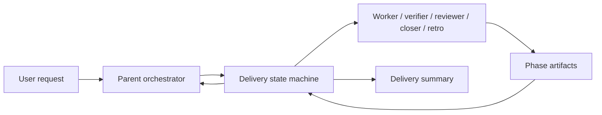
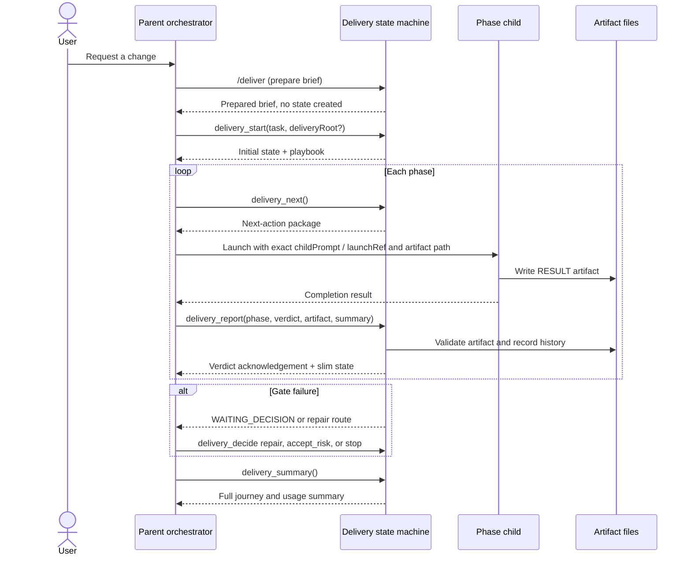

# Delivery state machine: how a delivery moves through the system

This guide explains the delivery state machine for people who need to run, integrate with, or troubleshoot a delivery. It focuses on the behavior that exists today: who does what, which data moves between steps, and where results are stored.

For implementation details, see [`index.ts`](../index.ts). For child-prompt construction, see [`prompt-construction.md`](prompt-construction.md). Historical token-efficiency measurements and future optimization work live separately in [`TOKEN_EFFICIENCY_PLAN.md`](../TOKEN_EFFICIENCY_PLAN.md).

## 1. The mental model

A delivery has one parent orchestrator and one or more child agents:



- **Parent orchestrator** drives the loop by calling `delivery_*` tools and launching children.
- **Delivery state machine** owns phase order, launch settings, worktree targeting, artifact validation, verdicts, repair routing, and usage accounting.
- **Child agents** perform the phase work and write a result artifact. They do not advance the delivery themselves.
- **Artifacts** are the durable evidence for each phase, normally under `~/.pi/delivery-run/...` or the configured project run directory.

The parent should treat the structured `details` fields returned by the tools as authoritative. The human-readable `content[0].text` is a compact transcript/status view.

## 2. End-to-end flow



The normal loop is:

1. `/deliver` prepares the request; it does not create delivery state.
2. `delivery_start` creates state and records the authoritative delivery root.
3. `delivery_next` returns the next phase launch package.
4. The parent launches the configured child or children.
5. Each child writes its artifact at the exact planned path.
6. `delivery_report` validates and records the artifact and verdict.
7. The parent calls `delivery_next` again.
8. A failed VERIFY or REVIEW may route back to IMPLEMENT, or pause for an explicit decision.
9. RETRO completes the run; `delivery_summary` writes the durable journey summary.

## 3. Starting a delivery and choosing its root

For repository work, every phase must run in a dedicated linked git worktree. The parent creates the worktree and supplies its absolute path:

```bash
git fetch origin
git worktree add -b <branch> <path-outside-main-working-tree> origin/main
```

```text
delivery_start({
  task: "...",
  deliveryRoot: "/absolute/path/to/linked/worktree"
})
```

The state machine:

- rejects the repository's main working tree, including a subdirectory of it;
- rejects a missing path and a path belonging to another repository;
- keeps the supplied root sticky across `delivery_status`, `delivery_next`, reports, and resumed sessions;
- derives child `cwd`, `gitRoot`, artifact-root resolution, and harness-root context from that root;
- records the outcome in `state.worktreePolicy` and exposes it in status/next responses.

A delivery started from an existing linked worktree may omit `deliveryRoot`; the session cwd is used and validated. Non-git work is allowed because there is no repository tree to protect, and records that the worktree policy is not applicable.

## 4. What the tools return

### `delivery_next`: the next action

`delivery_next` returns a short status message and structured details:

```text
details
├── state   slim current snapshot
└── next    next-action package
    ├── phase, agent, model, thinking, context
    ├── artifact, output, outputMode
    ├── childPrompt                 authoritative child instructions
    ├── orchestratorInstruction     parent-only launch guidance
    ├── reportInstruction           parent-only reporting guidance
    └── parallel[]?                 one package for each parallel child
```

The parent must pass `details.next.childPrompt` verbatim as the child task, or use the canonical `launchRef` supplied by the state machine. It must use the exact planned artifact path in `details.next.artifact`.

There is no `details.next.prompt` response field. The old compatibility mirror was removed and is not used by the runtime.

### `delivery_report`: record the result

`delivery_report` accepts the phase verdict, summary, artifact path, and usage metadata. It:

- checks that the artifact exists at the exact planned path;
- validates the `RESULT` line and required phase headings;
- validates harness evidence and path safety;
- records history, steps, usage, and pending issues;
- determines the next phase or pauses for a decision.

It returns an acknowledgement and slim state. It does not return the next launch package; call `delivery_next` for that.

### Full-state readers

- `delivery_status` shows the current state and the authoritative root.
- `delivery_summary` renders the complete journey, phase artifacts, and usage accounting.

## 5. What a child receives

The child prompt is assembled from a small number of layers:

```text
project harness guidance
+ common child workflow
+ phase instructions
+ task text
+ round / repair context when applicable
+ artifact contract and exact output path
+ resolved project/worktree root
+ authority guidance for named sources
```

The phase determines the child role:

| Phase | Child responsibility | Writes |
|---|---|---|
| IMPLEMENT | Make the requested change; sole writer | implementation artifact |
| VERIFY | Independently check the candidate | verification artifact |
| REVIEW | Independently assess the candidate; may run in parallel | one review artifact per reviewer, then aggregate |
| CLOSE | Perform the approved close-out flow | close artifact |
| RETRO | Record durable lessons and follow-ups | retrospective artifact |

Children should read any named authoritative source before acting. Read-only gates must not modify the candidate. IMPLEMENT is the sole writer for implementation changes.

## 6. Artifacts and verdicts

Every phase artifact begins with a verdict:

```text
RESULT: PASS
```

The remainder follows the phase-specific headings. The state machine validates the artifact when `delivery_report` is called; a child saying “done” without a valid artifact is not sufficient evidence.

For parallel REVIEW, each reviewer writes a separate artifact. The state machine creates the aggregate review result using conservative precedence:

```text
FAIL > PASS_WITH_NON_BLOCKING_NOTES > PASS
```

A failed VERIFY or REVIEW is not silently ignored:

- a supported must-fix finding can route back to IMPLEMENT;
- an exhausted or ambiguous failure pauses for the parent's explicit decision;
- `accept_risk`, `stop`, and `defer` decisions are recorded rather than inferred.

## 7. Quick reference

| Need to… | Use | Remember |
|---|---|---|
| Prepare a request | `/deliver` | Does not create state |
| Start a run | `delivery_start` | Supply a linked worktree for repository work |
| Get the next child launch | `delivery_next` | Use `details.next.childPrompt` and the exact artifact path |
| Record a phase | `delivery_report` | Artifact evidence is required |
| Inspect current state | `delivery_status` | Root and worktree policy are authoritative here |
| Resolve a failed gate | `delivery_decide` | Requires an explicit decision |
| See the complete journey | `delivery_summary` | Includes artifacts and usage |

## 8. Source of truth

When this guide conflicts with runtime behavior, use the following order:

1. The delivery state machine and its tests in [`index.ts`](../index.ts) and `tests/`.
2. The phase prompt and artifact contract for the active phase.
3. This overview document.

The state machine is intentionally strict about launch identity, artifact paths, verdicts, and repository roots so that a delivery's evidence remains reviewable and reproducible.
